# horizontall

## intro

horizontall is a box that you will want to enumerate eveything or atleast tried to enumerate everything from application version to its dns and directories

without further ado lets get started

## setup

first of all lets connect to the horizontall machine

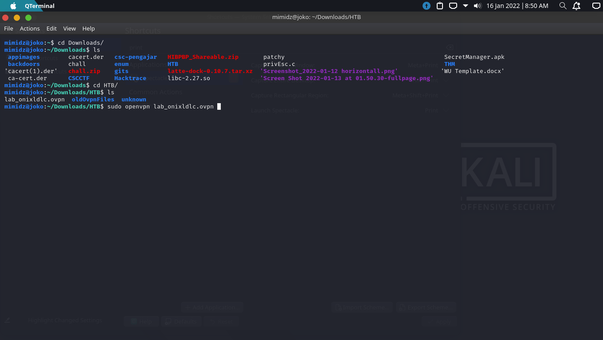

and i dont think this is necesary but its a best practice to just add the machine ip with a domain name to the `/etc/hosts` file \
with a format `<ip> <chal_name>.htb` \
with:

`sudo nano /etc/hosts`

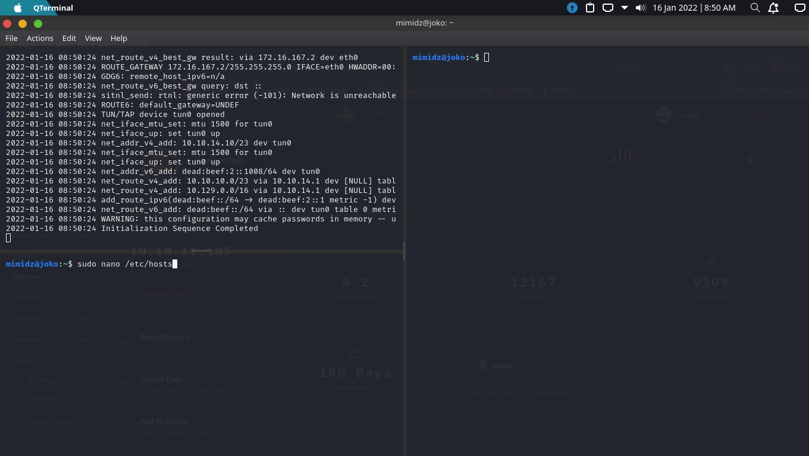

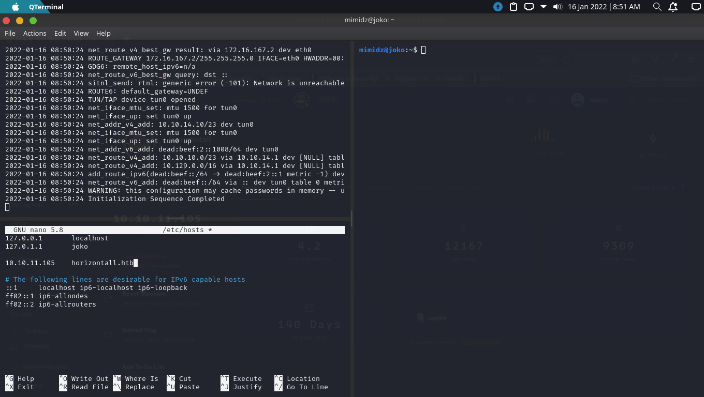

## initial recon

  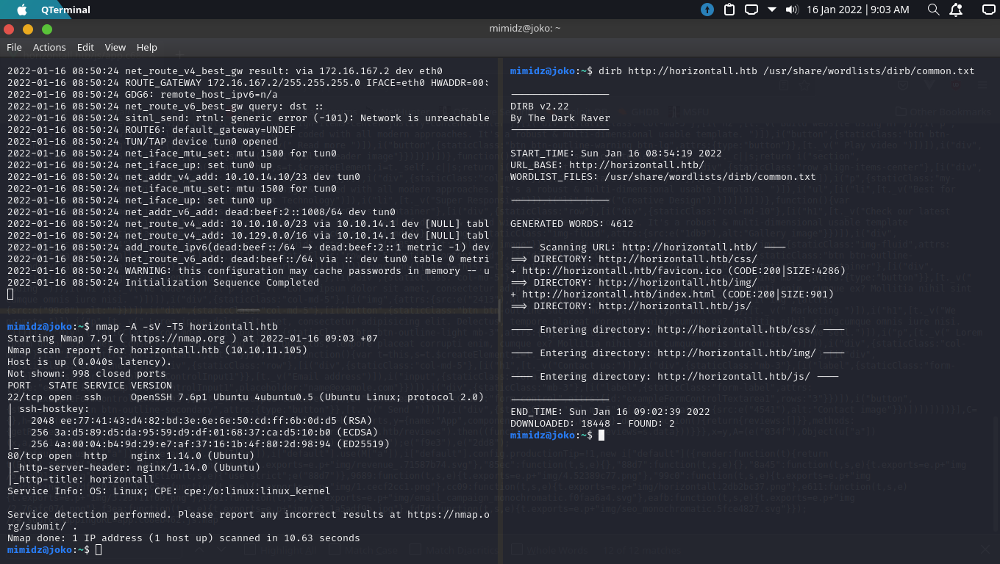

- ### nmap
  
  like any other chalange we need to see all the open port and if there are any interesting open port for this we just need to run the nmap command like this

  `nmap -A -sV -T5`

  from here as we can see there is only 2 port its 22 and 80 which is the port of ssh and http, so not that interesting

- ### dirb
  
  and ofcourse since this box has http port open that means it has an active web and we need to check for any interesting folder or files that might gives us a clue on where to go next, and we can check them by using this command

  `dirb http://horizontall.htb /usr/share/wordlists/dirb/common.txt`

  but as we can see from the out put there is only some files and folder and none of them really interesting

- ### open the web

  since i didnt really found anything interesting from the scans i finally just open the web it self and this is what i got

  

  and surprise surprise none of the button works so next i check for the source code to see if the devs leak anything

  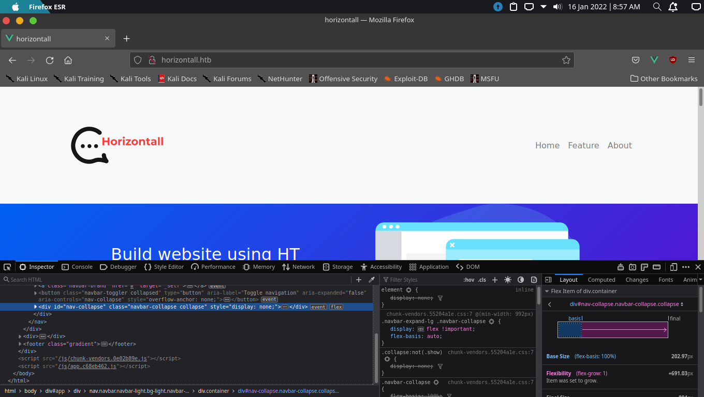

  after scrolling down i found 2 js that might be interesting so next i open those two

  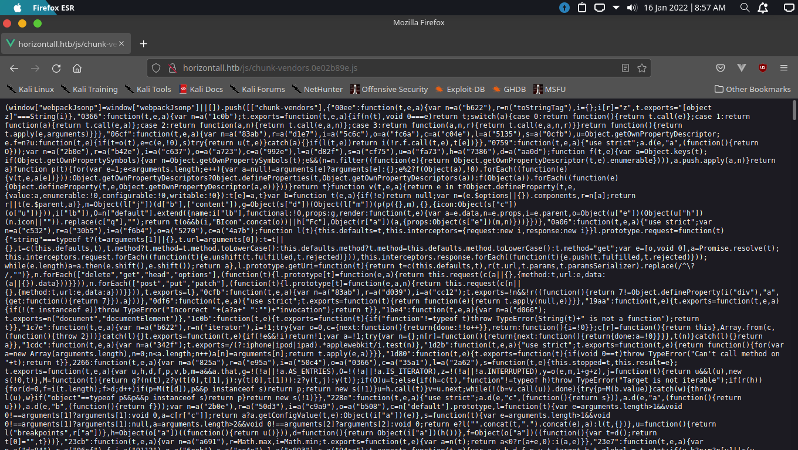

  on the 0eo2 or the chunk folder there isnt much of anything i tried to search for something but nothing came up next i check the app js thing

  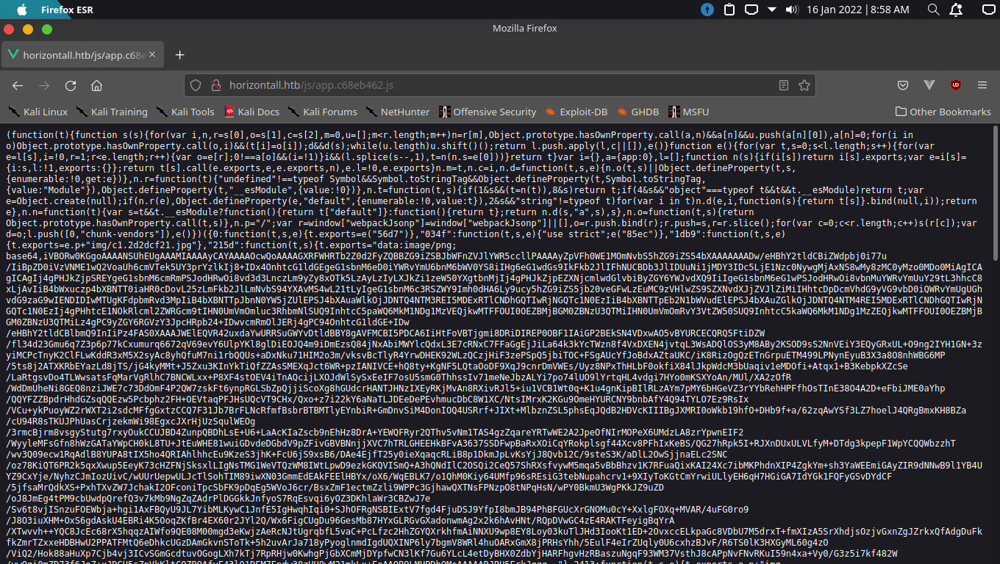

  there is nothing interesting i can see altho there is a base64 text there but if you tried to put it on cyberchef it would only result in a github picture, so no luck there...

  altho i did tried to search for some keyword like maybe there is a url or maybe other dependencies and this is what i found

  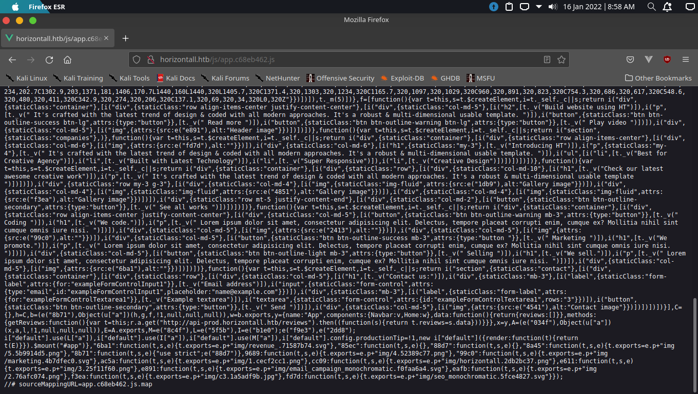

  ... so can you see it ? no ? yea me too XD so here is how i actually found it

  

  there it is :D and just incase you still cant see it its

  `http://api-prod/horizontall.htb/reviews`

  and the next thing i did was...\
  continue reconning...

  :|

  look... i didnt know if this subdomain a rabbit hole or not i just kept searching for other clues

- ### wfuzz
  
  after looking for hours i finally gave up on finding any other clue on the js file, so instead googled on how to scan or bruteforce a sub domain, then i found this [page](https://infinitelogins.com/2020/09/02/bruteforcing-subdomains-wfuzz/)

  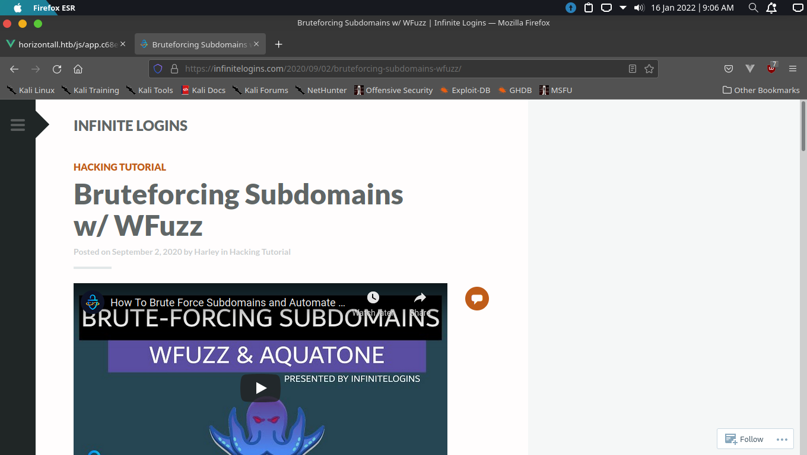

  from this page i found that all i need to do is to execute this command

  `sudo wfuzz -c -w /usr/share/seclists/Discovery/DNS/subdomains-top1million-110000.txt --sc 200 -u 'http://horizontall.htb' -H "Host: FUZZ.horizontall.htb"`

  it is a long command but here is what i found...

  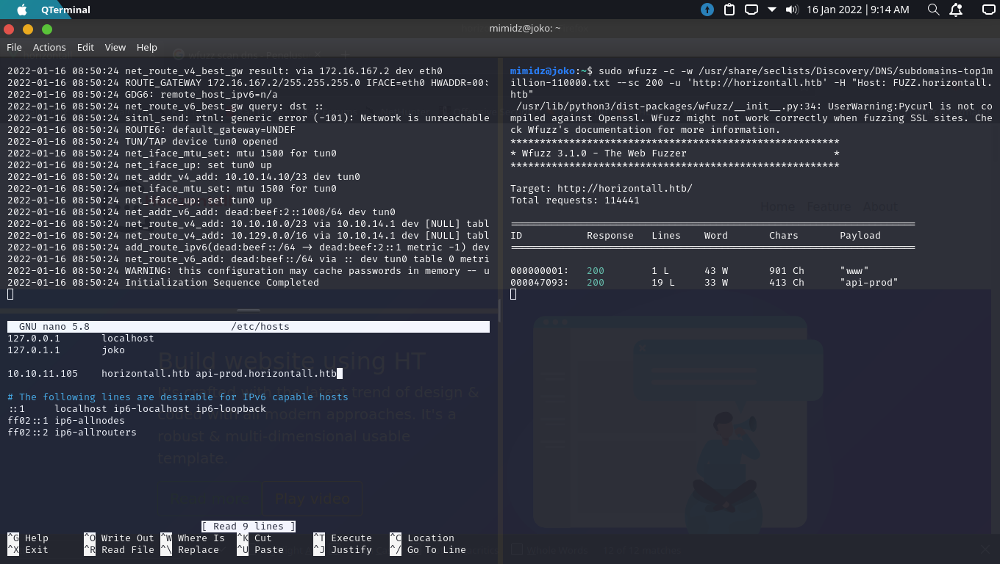

  after knowing api-prod is an actual subdomain i added it to my hosts file in the `/etc/hosts` with the same command to add domain name to the ip on the setup phase
  
  and i just add the `...api-prod.horiz...` to the front of the original domain name so it would result in

  `<ip addr> <domain name>.htb api-prod.<domain name>.htb`

## user

after adding the subdomain name to the hosts file now we can open it and see what is inside the api-prod web

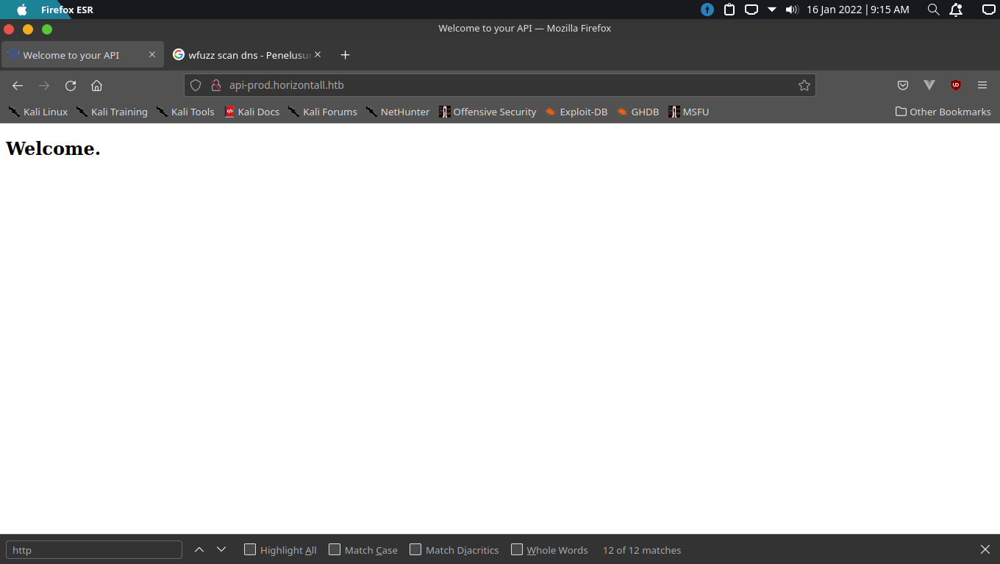

after getting disapointed because there is nothing important or interesting on the web i go back to reconning

- ### user recon
  
  - **user dirb**

    next thing i did is to check for any hidden folder or file in the new web and here is what i found

    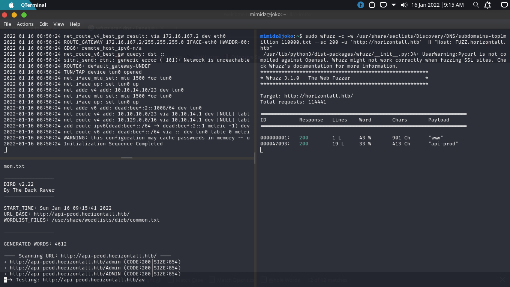

    and from what we can find is that there is an admin folder in the subdomain

    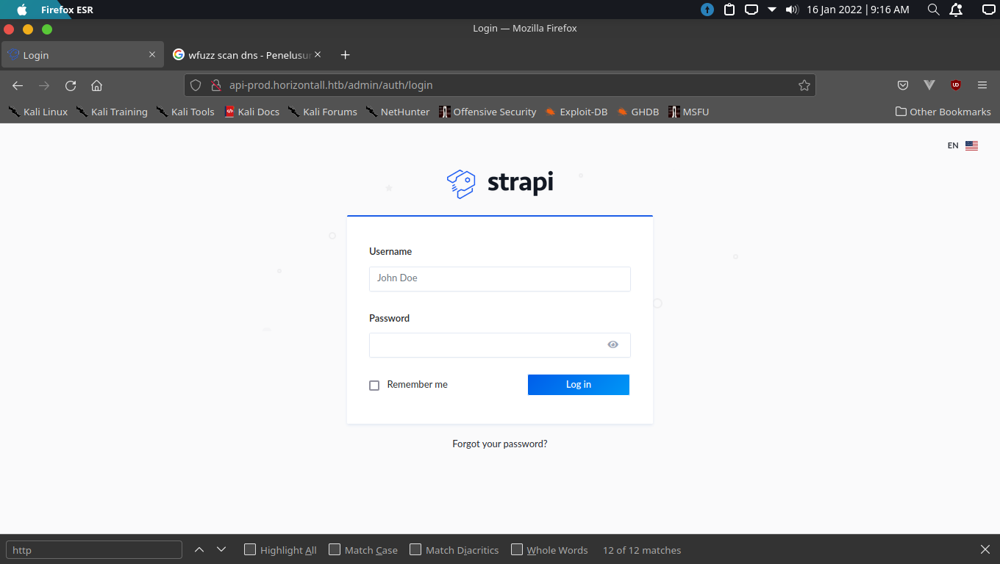

    and lo and behold an admin login form from here i didnt see any clue other than try to read the source code, and so i did

  - **finding version or vulnerable dependencies**

    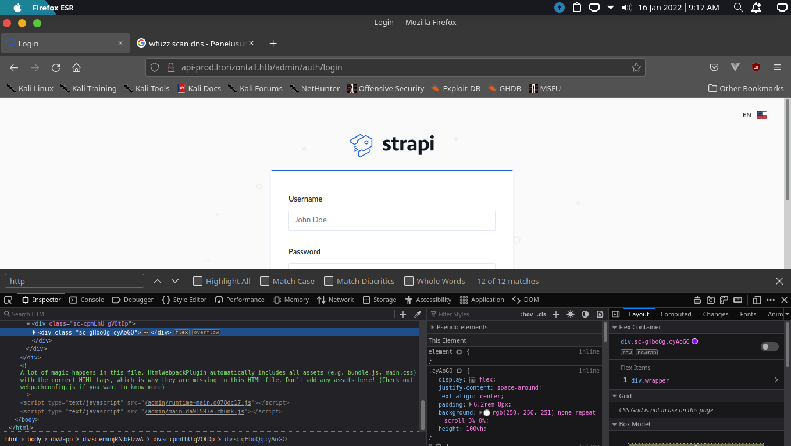

    and what i found is there is 2 js file that got called so lets check all the js file and see if there are any other clue maybe a version or maybe any dependecy that are broken

    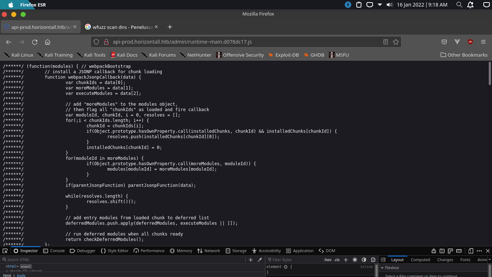

    on the runtime js i didnt see anything use full and i also search for some maybe strapi or dependecy but there is nothing there

    

    after no luck at finding anything on the runtime js i finally found something by searching some https and http and what i found is that this is `strapi-plugin-type-builder@3.0.0-beta.17.4`

    after knowing the version of the strapi i check for any vulnerability for strapi 3.0.0 beta 17.4 ... and voila...

    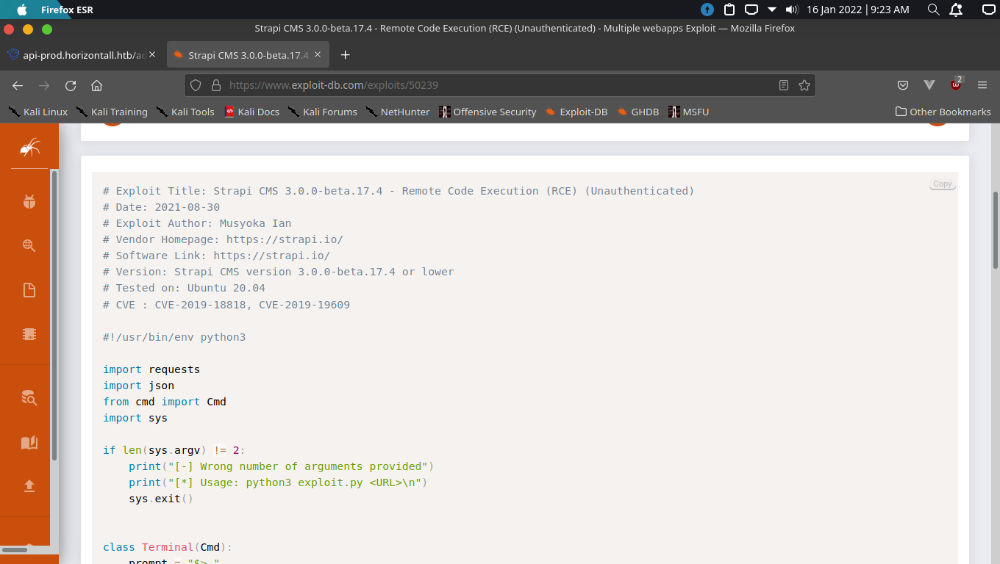

- ### user exploitation

  an unauthenticated rce exploit on CMS strapi 3.0.0-beta.17.4 which is the perfect exploit for this scenario... and running the exploit i did

  

  

  

  and after running the exploit as we can see the user:password is admin:SuperStrongPassword\
  and also... we got unstable shell ! :D not bad...

  next i will be loging in to the admin and try to find a way to maybe add more stable shell 

  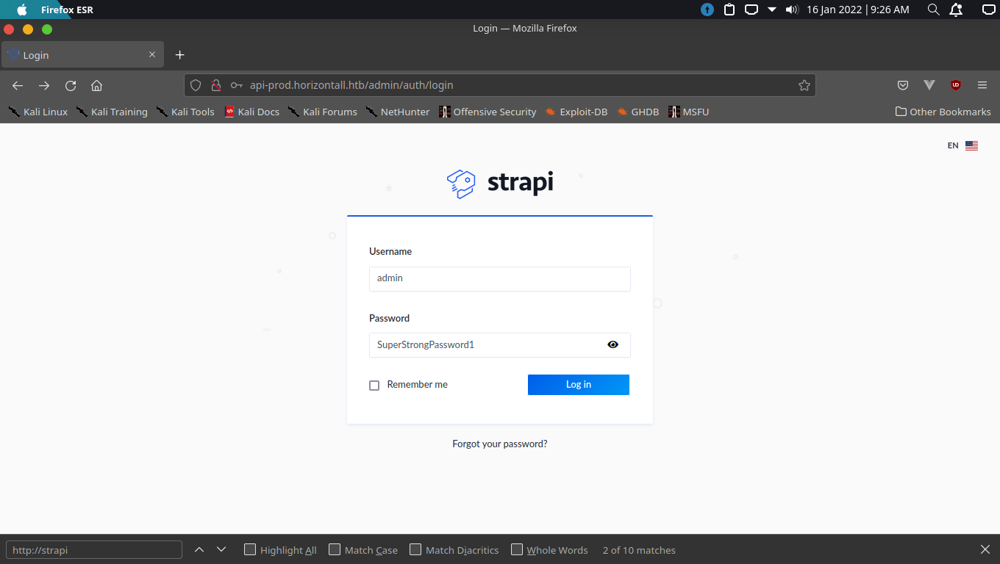

  and this is what i found after logging in

  

  after seeing the file upload i rushed to see what is in it and this is what i found

  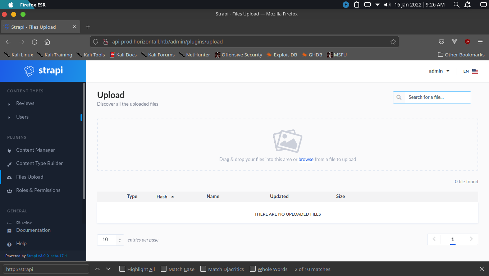

  after this i found this and play around a bit with it it apparently accept any file that i throw at it

  after that i tried to get a bash shell to pop up because apparently the unstable shell doesnt even print anything back

  

  after getting the shell i tried to list all the available directories... and this is what i found

  

  if you are confuse on why i mark those red and yellow... basically what i can conclude from this is that the strapi user has a home which usually doesnt mean you can connect through ssh to the strapi user... but it just gave me the idea to do so

  then what is it that i mark with yellow ? it literally means as strapi you can change or add any folder you want...

  tldr; there is a possibility you can spawn shell on strapi using ssh

  i then create the .ssh directories

  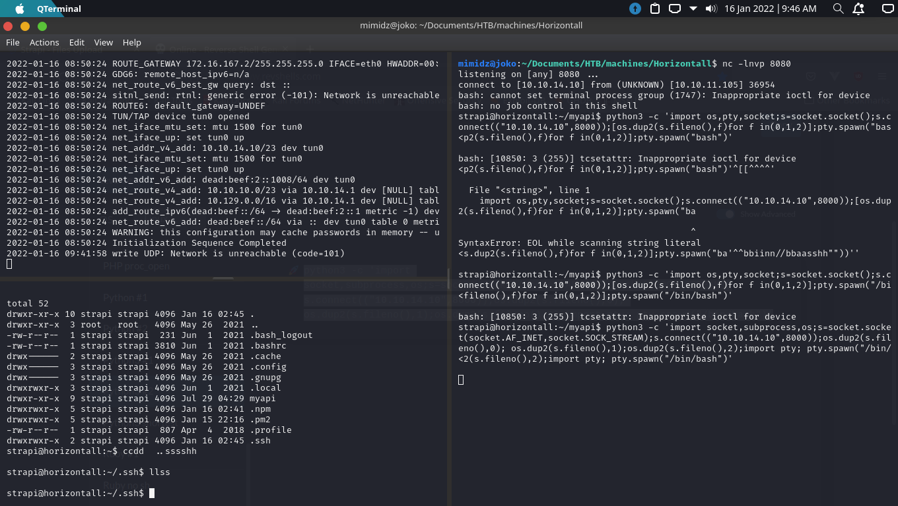

  and then after creating the directories i generate my private and public key like so

  

  and then i just copied it and start using the ssh like so

  

- ### user flag

  after getting the ssh next i tried to open the usual flag spot for htb (usually its in the /home/user/user.txt)

  

  and... it is

## root

after getting the user flag... now we need to privilege escalate our way to root, or atleast find a way to run a command on root privilege

- ### root recon

  yes another recon and it is alot of reconning but, atleast this time we use another tool and its called [linpeas](https://linpeas.sh/)
  
  - **root linpeas**

  so first of all lets upload the linpeas into the machine, this time i used the strapi to upload it and i will spare you the detail since i only drag and drop the linpeas script

  and after i found the script i just copy it and rename it to the original file

  

  after getting the linpeas into the machine i just need to change the permission and run it and output it to a `tempfile.txt`

  

  i then just cat the output file and pipe it to less so that i can scroll up and down on the output and also -R to add color to it

  and now i just need to find everything that is in red and check if there are any vulnerability on it

  

  

  

  

  - **root active ports**

  and after trying and googling all the red labled texts the only thing i have not tried is to see the active port

  and i just curl it through the ssh and this is what i've got

  

  the curl for port 1337 is not that interesting although the port 8000 is but just incase i just copied all the output and put it inside of a text (i used sublime to copy paste and open it on the browser)

  and these are the result

  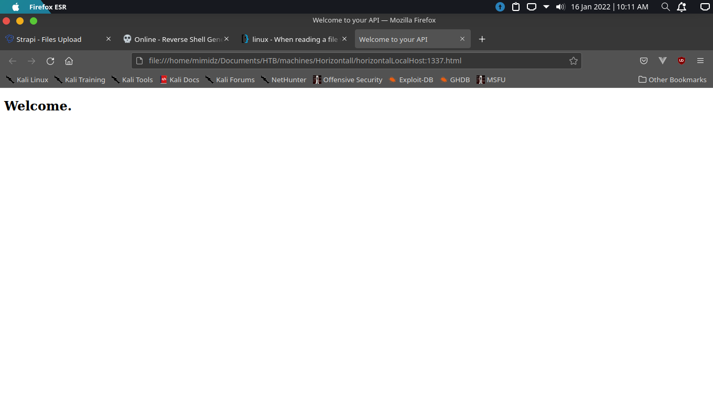

  and

  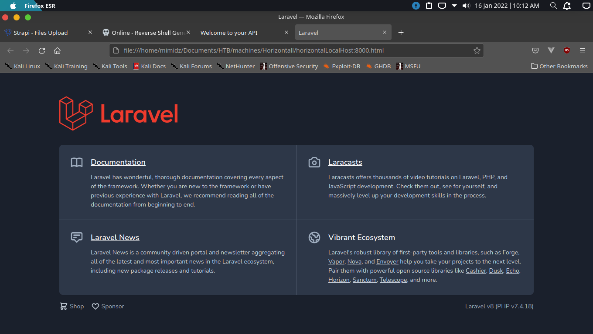

  so nothing really big... but then i looked at the port 8000 one, the laravel web page it says it in the page that its laravel version 8 with php version 7.4.18

  

- ### root exploitation

  and so... i just google it since i might find some exploit...\
  and... exploit i got 

  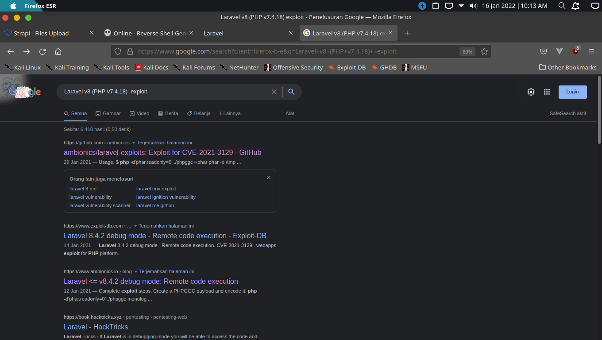

  its the [CVE-2021-3129](https://github.com/ambionics/laravel-exploits), i then just download the exploit by using\
  `wget <script_raw_version_url>` 

  

  but then after seeing how the script works it seems like you need to download the [phpggc](https://github.com/ambionics/phpggc) to actually run the exploit 
  
  
  
  and so i download it

  

  but since the phpggc is not a single script i had to clone the github repo and zip the phpggc to send it to the strapi

  i then ran python http.server and download the zip and script from the strapi ssh shell

  

  this time i used python http.server since i dont want to rename the file after uploading like when you tried to upload with the strapi

  then after i download it from the strapi ssh i just unzip it

  

  then i tried to run the script, and...

  

  i ran in to an error

  after looking at the script i found the proble, the script would need python3.8 above but the python in the horizontall box was only 3.6 or 3.7 and since dataclasses was not a feature in 3.7 below it throws a no module name 'dataclasses' error (although CMIIW becs im not good with python version and cappabilities) and what i think i can do was just to change some stuff and hope it works

  tldr; need to change the CVE-2021-3129 exploit to run on python 3.7 below

  and change some stuff i did

  

  then after those small tweaks its working as expected

  

  and then i just run the exploit, and...voila...

  

- ### root flag

  then after testing it works with id i just print the flag

  

  and boom now you also got the flag

- ### additional stuff

  now i did tried to get a root bash... but then after couple of tries i just gave up

  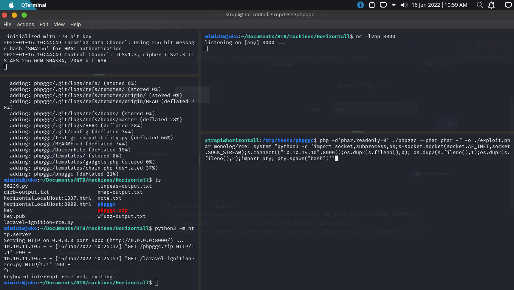

  since its seems to complex and would have taken alot of time... and it did... becs its very uncomfortable to type because everytune you typed a single letter it gets doubled or even copied a text it got doubled its very anoying

  

  but in the end... i still got the root ssh

  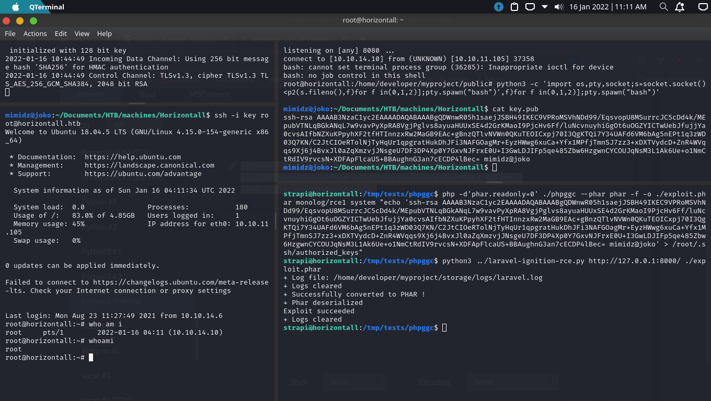

  

  